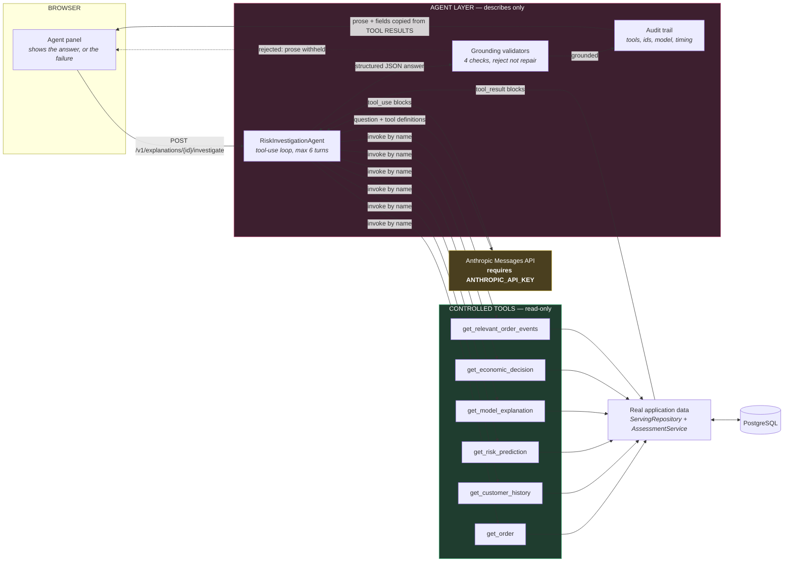
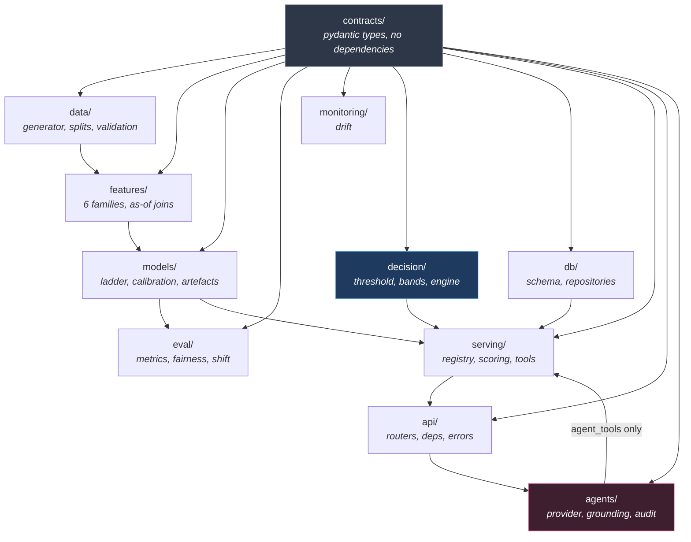
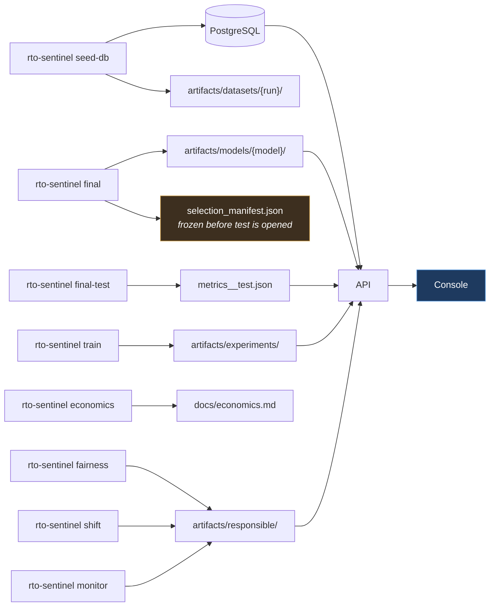

# RTO Sentinel — system architecture

Two flows, drawn separately because the whole design rests on keeping them apart.

The **decision flow** produces a risk probability and turns it into an action.
The **explanation flow** describes a decision that has already been made. The
second cannot reach into the first, and the separation is enforced by import
rules that fail the build rather than by convention.

`ARCHITECTURE.md` at the repository root carries the full detail — module
inventory, every boundary test, the rationale for each layer. This document is
the picture.

---

## 1. The decision flow

```mermaid
flowchart LR
    subgraph client["BROWSER"]
        UI["Merchant console<br/><i>React + TypeScript</i><br/>renders, computes nothing"]
    end

    subgraph api["API — FastAPI"]
        R["Routers<br/><i>validation, error envelope</i>"]
        D["Dependencies<br/><i>assembles the chain</i>"]
    end

    subgraph services["SERVING"]
        REPO["ServingRepository<br/><i>SQLAlchemy, bound params</i>"]
        FEAT["OrderFeatureService<br/><i>as-of aggregates</i>"]
        SCORE["ScoringService"]
        REG["ModelRegistry<br/><i>loads, verifies, caches</i>"]
    end

    subgraph ml["MODEL"]
        LGB["LightGBM<br/><i>rung 4</i>"]
        CAL["Platt calibrator<br/><i>fitted on validation</i>"]
    end

    subgraph engine["DECISION ENGINE — deterministic"]
        TH["Threshold<br/><b>C_fp / (C_fp + S_tp)</b>"]
        BAND["Band ladder<br/><i>LOW / ELEVATED / HIGH / SEVERE</i>"]
        RC["Reason codes<br/><i>from SHAP attributions</i>"]
    end

    DB[("PostgreSQL<br/>10 tables")]

    UI -->|"HTTPS · GET /v1/orders/{id}/risk"| R
    R --> D
    D --> REPO
    REPO -->|"order + history rows"| FEAT
    FEAT -->|"54 features"| SCORE
    REG -->|"verified artefact"| SCORE
    SCORE --> LGB
    LGB -->|"raw score"| CAL
    CAL -->|"calibrated P(RTO)"| TH
    TH --> BAND
    BAND --> RC
    RC -->|"probability + band + action + reasons"| R
    R -->|"one JSON response"| UI
    REPO <--> DB

    style engine fill:#1e3a5f,stroke:#4a90d9,color:#fff
    style ml fill:#3d2f1f,stroke:#c9973f,color:#fff
    style DB fill:#2d3748,stroke:#718096,color:#fff
```

**What the arrows mean.** The model emits a probability and nothing else. The
decision engine converts that probability into an action using merchant
economics. The threshold is **derived, never chosen** — it is `0.3481` for the
default profile, not `0.5`, and it moves when the merchant's margin moves.

**Direction that surprises people:** a *higher* contribution margin *raises* the
threshold, so a high-margin merchant flags **less**. A false positive costs more
when the order you drove away was worth more. Verified live: margin ₹250 →
threshold 0.348 and 19.1% flagged; margin ₹1,800 → threshold 0.776 and 0.1%
flagged.

---

## 2. The explanation flow

**The agent may not compute anything.** `probability`, `band`, `threshold` and
`model_version` in the response are copied by the backend from tool results, not
parsed out of the model's prose. A model that writes "the probability is 0.01"
cannot change what the screen reports — asserted against real data by
`test_the_agent_cannot_change_the_probability_it_reports`.

### The four mechanisms that enforce it

| # | Mechanism | Test |
|---|---|---|
| 1 | `agents/` cannot import `decision`, `models`, `features`, `data` or `eval` | `test_agents_cannot_reach_the_decision_engine_or_models` |
| 2 | `agents/` reaches `serving/` **only** through `agent_tools`, the tool registry | `test_agents_reach_serving_only_through_the_tool_registry` |
| 3 | The package cannot name a repository, `session_scope`, `.commit(`, `.flush(` or `session.add(` | `test_the_agent_layer_holds_no_write_capability` |
| 4 | Reported fields come from tool results; prose is never parsed for numbers | `test_retrieved_values_are_reported_not_the_models_prose` |

**No key, no answer.** If `ANTHROPIC_API_KEY` is unset or
`RTO_AGENTS_ENABLED` is false, the endpoint returns 501/503 naming the variable.
It does not fall back to a scripted sentence — a canned explanation would be
indistinguishable from a model-generated one to every consumer, and would carry
the authority of an "AI explanation" with nothing behind it.

---

## 3. Layer dependency rules

Seven rules, each a test in `tests/architecture/test_layering.py`, parsing the
real import graph including `TYPE_CHECKING` blocks. A type-only import of an LLM
SDK into the decision engine would not execute — but it would mean someone was
reaching for it, and the point of a boundary is to notice.

The `decision/` layer imports **no** database, web framework, HTTP client or LLM
SDK. It is pure arithmetic over `CostInputs`, which is what makes it testable
without a server and impossible to influence from a prompt.

---

## 4. Request lifecycle, end to end

What actually happens when a merchant clicks **Investigate** on one order:

| Step | Component | Measured cost |
|---|---|---|
| 1 | Console issues `GET /v1/orders/{id}/risk` | — |
| 2 | Pydantic validates the id against a pattern | <1 ms |
| 3 | `ServingRepository` loads the order and its history window | part of step 4 |
| 4 | `OrderFeatureService` computes 54 features as-of the order timestamp | **~2,300 ms** |
| 5 | `ModelRegistry` returns the cached, integrity-checked artefact | 0 ms (28 ms once) |
| 6 | LightGBM predicts; Platt maps the score to a probability | **~16 ms** |
| 7 | TreeSHAP produces per-feature attributions | **~670 ms** |
| 8 | `DecisionEngine` derives the threshold, assigns a band, emits reason codes | <1 ms |
| 9 | Response serialised with model, feature and engine versions attached | <1 ms |

**Total ~3 s, and the model is 0.5% of it.** The expense is rebuilding the
as-of feature context from thousands of history rows per request. Anyone
optimising this should not touch LightGBM. Adequate for merchant-initiated
investigation; not viable for synchronous checkout scoring — see
`docs/phase11_report.md § 7`.

---

## 5. Where every number on screen comes from

Every displayed value is a backend response, and every backend metric is read
from an artefact a command wrote. Nothing is recomputed at request time to
satisfy a chart, and nothing is hardcoded in the frontend. Where an experiment
has not been run the endpoint returns **501 with its reason** and the console
renders that reason — an empty table would read as "we checked and found
nothing", which is a different and much worse claim than "we have not checked".
